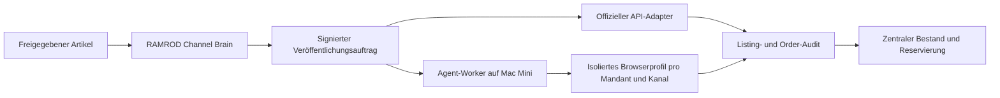

# RAMROD Kanal- und Distributionsstrategie

Stand: 2026-07-20

## Kurzfassung

eBay bleibt wichtig, darf aber nicht die Verkaufsstrategie bestimmen. RAMROD soll aus einem Artikel nicht einfach zehn identische Listings machen, sondern den wirtschaftlich besten Vertriebsmix wählen.

Das Zielbild besteht aus vier Kanaltypen:

1. **Eigener Handel:** RAMROD Shop auf `ramrod.live` für Marge, Marke, Kundendaten und Wiederkäufe.
2. **Reichweiten-Marktplätze:** eBay, Whatnot, TikTok Shop, Kleinanzeigen und ausgewählte große Marktplätze.
3. **Vertikale Spezialbörsen:** Cardmarket, BrickLink, Discogs, Etsy, Catawiki, Delcampe und Reverb.
4. **Abverkauf und Nachfrage:** Google Shopping, Instagram, TikTok Content, lokale Käufer, B2B-Posten und Ankaufdienste.

Nicht jeder Artikel gehört auf jeden Kanal. Ein seltenes Einzelstück darf nur dort parallel angeboten werden, wo Verkaufssignale schnell zurücklaufen und RAMROD die übrigen Angebote sofort reservieren oder beenden kann.

## Strategische Entscheidung

### Der eigene Shop wird der Heimatkanal

Der RAMROD Shop soll langfristig der wichtigste Marken- und Kundenkanal werden. Shopify übernimmt Checkout, Zahlungen, Steuer-, Bestell- und Rückgabeprozesse. RAMROD und Supabase bleiben der Master für Artikelidentität, Strategie, Eigentümer, Lagerort und kanalübergreifenden Status.

Der eigene Shop allein erzeugt anfangs aber nicht genug Nachfrage. Marktplätze bleiben deshalb wichtig als:

- Suchmaschine für konkrete Produkte,
- Preis- und Nachfragesignal,
- Liquiditätskanal,
- Einstieg für neue Käufer,
- Testfeld für Kategorien und Preispunkte.

### Streuen bedeutet nicht blindes Crosslisting

RAMROD verteilt nach Artikeltyp:

- **Einmalige Einzelstücke:** eigener Shop plus höchstens ein oder zwei synchronisierbare Fremdkanäle.
- **Mehrfachbestand:** breites API-basiertes Multichannel-Listing.
- **Live-Artikel:** für die Dauer einer Show oder Kampagne exklusiv reservieren.
- **Sperrige Ware:** lokal mit Abholung.
- **Niedrigpreisige Ware:** bündeln, live verkaufen oder liquidieren.
- **Hochwertige Spezialware:** Fachbörse oder kuratierte Auktion vor Massenmarktplatz.

## Kanalportfolio

### Stufe A: Kernkanäle

| Kanal | Rolle | Geeignete Ware | Automatisierung | Entscheidung |
| --- | --- | --- | --- | --- |
| RAMROD Shop / Shopify | Heimatkanal, Marge, Marke, Kundenbindung | gute Einzelstücke, Bundles, Drops, wiederholbarer Bestand | Admin API und Webhooks | sofort aufbauen |
| Google Shopping / kostenlose Einträge | qualifizierter Traffic zum eigenen Shop | fast alle shopfähigen Artikel mit stabiler Produktseite | Merchant API und Produktfeed | direkt mit Shop anbinden |
| eBay | globale Suche, Preisanker, Einzelstücke | Games, Toys, Figuren, Collectibles, Ersatzteile | Sell APIs, Orders und Fulfillment | Kernconnector fertigstellen |
| Whatnot | Live-Commerce und schneller thematischer Abverkauf | live erklärbare Sammlerware, Bundles, Karten, Figuren | aktuell Shopify-Sync; Seller API nimmt keine neuen Bewerber an | über Shopify integrieren |
| TikTok Shop | Discovery Commerce, Video und Live | visuelle Produkte, günstige Einstiegsartikel, Drops | Partner-/Shop-APIs nach Freigabe | kontrollierten Pilot starten |
| Instagram | Nachfrage, Vertrauen und Shop-Traffic | Fundstücke, Vorher/Nachher, Kistenöffnung, Drops | Content Publishing API für professionelle Accounts | als Demand Engine anbinden |
| Kleinanzeigen | lokaler Verkauf und Abholung | Konsolen-Bundles, Kisten, sperrige Ware, Haushaltsware | keine allgemeine öffentliche Listing-API identifiziert; PRO/Partner prüfen | browser-assistierter Pilot |

### Stufe B: Spezialbörsen mit hoher Relevanz

| Kanal | Vertikale | Automatisierung | Wichtige Einschränkung | Priorität |
| --- | --- | --- | --- | --- |
| Cardmarket | Pokémon, Magic, Yu-Gi-Oh! und weitere TCG | API vorhanden | derzeit keine neuen API-Zugänge; Partnerlösung oder assistierter Export nötig | sehr hoch bei Kartenvolumen |
| BrickLink | LEGO Sets, Teile und Minifiguren | öffentliche Store REST API für Bestand, Preise und Orders | genaue Katalogzuordnung nötig | hoch bei LEGO-Bestand |
| Discogs | Vinyl, CDs und Musikmedien | API sowie Bestandsimporte | Release-/Pressungsidentität muss belastbar sein | hoch bei Musikbestand |
| Etsy | Vintage und kuratierte Sammlerstücke | Open API | Vintage muss mindestens 20 Jahre alt sein; normale Wiederverkäufe sind nicht pauschal erlaubt | selektiv |
| Catawiki | seltene, hochwertige und kuratierbare Objekte | Einreichungs- und Expertenprozess, kein normaler Massenfeed | Identitätsprüfung und Expertenfreigabe; Auktionen können nicht beliebig beendet werden | manuell assistiert |
| Delcampe | Briefmarken, Postkarten, Papier, Münzen, ältere Sammlerware | API Pass für professionelle Accounts | kostenpflichtiger Pro-Zugang | bei passendem Bestand |
| Reverb | Instrumente, Studio- und Audioequipment | Listings-, Bestands- und Order-API | Shop- und Versandprofile teilweise manuell einzurichten | nur für Musikgear |
| Hood.de | deutscher General-Marktplatz | API für Platin-Shops und Partner | zusätzliche Shopkosten und geringere Reichweite als eBay | nach Wirtschaftstest |

### Stufe C: Katalog- und Massenmarktplätze

| Kanal | Gute Eignung | Schlechte Eignung | Automatisierung | Entscheidung |
| --- | --- | --- | --- | --- |
| Kaufland Global Marketplace | neue, versiegelte oder eindeutig katalogisierte Ware mit EAN | unbekannte Einzelstücke und unklare Varianten | Seller API für Produkte, Bestand und Orders | erst bei genügend Katalogware |
| Amazon Marketplace | standardisierte Ware mit ASIN/EAN und reproduzierbarer Qualität | lose, unvollständige oder schwer beschreibbare Einzelstücke | SP-API | später und streng regelbasiert |
| OTTO Market | neue Markenware und sauberer Variantenbestand | gebrauchte Einzelstücke ohne EAN und belastbare Produktdaten | vollständige Produkt-, Bestands-, Order- und Ads-APIs | nicht im Sammler-MVP |

### Stufe D: Ergänzende und eingeschränkte Kanäle

| Kanaltyp | Beispiele | Rolle | Automatisierung |
| --- | --- | --- | --- |
| Lokale Communities | Facebook Marketplace, Facebook-Gruppen, Foren, Discords | lokale Nachfrage und Fachpublikum | Inhalte vorbereiten; Veröffentlichung anfangs manuell, kein Spam-Bot |
| Private Mode/Fashion | Vinted | private Kleidung, Schuhe, Taschen | nicht als deutscher Gewerbekanal planen; Vinted Pro ist laut aktueller Hilfe nicht für Unternehmen mit Sitz in Deutschland verfügbar |
| Luxus/Sneaker/Uhren | Vestiaire Collective, StockX, GOAT, Chrono24 | hochwertige Spezialware | Partnerzugang oder manuell assistierter Prozess vorsehen |
| Sofortankauf | momox, rebuy und spezialisierte Ankäufer | Preisuntergrenze und schnelle Liquidität | offizielle Geschäftslösung verhandeln; kein verdecktes Scraping |
| B2B/Liquidation | Händler, Auktionshäuser, Restpostenkäufer | ganze Kisten oder langsamer Bestand | Käufer-CRM, Angebots-PDF und manuelle Freigabe |
| Eigene Offline-Kanäle | Shop, Pop-up, Messe, Convention, Flohmarkt | Community, Vertrauensaufbau und Bundles | POS- und Reservierungssync statt externem Listing |

### Nachfragekanäle sind keine bloßen Listings

Pinterest, Instagram, TikTok, YouTube Shorts, Newsletter und Google Shopping sollen nicht mit identischen Produktkarten geflutet werden. RAMROD erstellt stattdessen Kampagnen:

- Kistenöffnung,
- Fund des Tages,
- Preisauflösung,
- Reparieren oder so verkaufen,
- Themenwoche,
- Drop-Vorschau,
- Whatnot-Show-Trailer,
- Sammlerwissen und Variantenvergleich.

Jede Kampagne führt zu einer kuratierten Shop-Seite, einem Drop, einer Show oder einem passenden Produktcluster.

## Channel Brain: automatische Kanalentscheidung

Für jeden Artikel erzeugt RAMROD Kandidaten und berechnet pro Kanal einen erwarteten Deckungsbeitrag:

```text
Erwarteter Kanalwert =
  Verkaufswahrscheinlichkeit im Zielzeitraum
  × erwarteter Nettoerlös
  - Plattformgebühren
  - Zahlungs- und Versandkosten
  - erwartete Retouren-/Konfliktkosten
  - Erfassungs- und Veröffentlichungsaufwand
  - kanalbedingte Lager- und Wartezeit
```

Der Score berücksichtigt:

- Kategorie, Marke, Franchise, Plattform, Alter und Barcode,
- Zustand, Vollständigkeit, Echtheits- und Defektrisiko,
- Artikelwert, Größe, Gewicht und Versandrisiko,
- aktive und verkaufte Vergleichsangebote,
- Sell-through und bisherige RAMROD-Verkäufe je Mandant,
- Kanalregeln und Pflichtmerkmale,
- aktuelle Themenkampagnen und Whatnot-Shows,
- Arbeitszeit pro Listing und erwartete Zeit bis zum Verkauf.

Das Ergebnis ist keine einzelne Plattform, sondern eine Strategie:

```json
{
  "primaryChannel": "bricklink",
  "secondaryChannels": ["ramrod_shop", "ebay"],
  "holdoutChannels": ["whatnot"],
  "strategy": "Einzeln listen; für 30 Tage nicht in Live-Show binden",
  "reasoning": [
    "LEGO-Katalognummer sicher erkannt",
    "BrickLink hat die präziseste Zielgruppe",
    "eBay erhöht internationale Reichweite",
    "Live-Abschlag wäre bei diesem Einzelstück zu hoch"
  ]
}
```

## Technische Automatisierungsstufen

Jeder Channel-Adapter erhält genau einen Betriebsmodus:

1. **API_FIRST:** offizielle API, OAuth, Webhooks und deterministische Fehlerbehandlung.
2. **PARTNER_FEED:** zugelassener Feed, Sales-Channel-App oder offizieller Integrationspartner.
3. **BROWSER_ASSISTED:** Agent füllt Entwürfe in einem isolierten Profil; Veröffentlichung und kritische Änderungen benötigen Freigabe.
4. **HUMAN_ONLY:** RAMROD erzeugt Bilder, Texte, Preis und Checkliste, ein Mensch reicht ein.
5. **UNAVAILABLE:** Kanal darf nur empfohlen, aber noch nicht ausgeführt werden.

Diese Einstufung muss pro Mandant und Kanal konfigurierbar sein. Strongvision kann beispielsweise einen verbundenen eBay-Account haben, während ein anderer Kunde zunächst nur Exportdateien erhält.

## Konten, E-Mail und Berechtigungen

### Kein autonomes Account-Farming

Ein Agent sollte nicht selbstständig Verkäuferkonten unter einer erfundenen Identität anlegen. Viele Plattformen verlangen:

- Zustimmung zu Verträgen und Händlerbedingungen,
- Unternehmens- oder Identitätsprüfung,
- Bank- und Steuerdaten,
- KYC/KYB,
- Zwei-Faktor-Authentifizierung,
- Verantwortung für Rückgaben, Produktsicherheit und Käuferkommunikation.

Diese Schritte gehören zu einem vertretungsberechtigten Menschen des jeweiligen Mandanten.

### Sauberes Kontomodell

1. Ein Admin erstellt und verifiziert das Verkäuferkonto.
2. In RAMROD klickt er auf **Kanal verbinden**.
3. OAuth oder ein eng begrenzter API-Schlüssel wird verschlüsselt pro Mandant gespeichert.
4. Der Agent erhält nur die für seinen Auftrag nötigen Tools und Scopes.
5. 2FA, Auszahlungen, Bankdaten, AGB-Zustimmung und Account-Wiederherstellung bleiben beim Menschen.

Eine zentrale Adresse wie `channels@ramrod.live` ist für Systemmeldungen sinnvoll. Für Mandanten können Aliase wie `strongvision-ebay@ramrod.live` genutzt werden. Das Postfach ersetzt aber weder die juristische Verkäuferidentität noch OAuth und sollte keinem Agenten als universeller Hauptschlüssel überlassen werden.

## Hermes und OpenClaw

### Wobei sie helfen können

Beide Systeme können als austauschbare Agent-Worker dienen:

- Listing-Entwürfe aus RAMROD-Daten erstellen,
- fehlende Pflichtfelder in einem Portal erkennen,
- freigegebene Formulare ausfüllen,
- Kampagnen- und Posting-Varianten erzeugen,
- Preis- und Markt-Recherche durchführen,
- wiederkehrende Aufgaben und Kontrollen planen,
- Browser-Fehler dokumentieren und an einen Menschen übergeben,
- über MCP mit freigegebenen RAMROD-Tools kommunizieren.

OpenClaw bietet verwaltete, getrennte Browserprofile, Browsersteuerung und geplante Aufgaben. Hermes bietet Browser-Backends, MCP-Toolfilter, Skills und ein mehrstufiges Sicherheitsmodell. Beide können technisch posten; keiner macht eine nicht vorgesehene Plattformintegration automatisch zuverlässig oder rechtlich zulässig.

### Empfehlung für RAMROD

Nicht beide Frameworks gleichzeitig in den Kern einbauen. RAMROD definiert einen neutralen Agent-Auftrag und testet zunächst **OpenClaw als Browser-Worker für genau einen Kanal ohne API**. Der Grund ist dessen klarer Ansatz mit isolierten, dauerhaften Browserprofilen und manueller Übergabe bei Login, 2FA oder Captcha. Hermes bleibt eine gute Alternative für Recherche-, Content- und MCP-lastige Aufgaben.

Der Worker läuft getrennt von der Web-App:



### Harte Grenzen für Browser-Agenten

- nur freigegebene Domains,
- getrenntes Profil pro Mandant und Kanal,
- keine persönlichen Browserprofile,
- Secrets aus einem Vault, niemals aus Prompt oder Datenbanktext,
- Dry Run und Screenshot vor dem ersten Publish,
- Freigabe für AGB, KYC, Bank, 2FA, Preis über Grenzwert und endgültiges Veröffentlichen,
- Rate Limits und Tagesbudgets,
- vollständiger Aktions- und Screenshot-Audit,
- sofortiger Kill-Switch pro Account,
- kein Captcha-Umgehen und kein Zugriff auf private Plattform-APIs.

## Benötigte Plattformbausteine

Die Kanalmaschine benötigt mindestens:

- `sales_channels`: Kanal, Modus, Länder, Kategorien und Status,
- `organization_channel_accounts`: verbundener Account und verschlüsselte Credentials je Mandant,
- `channel_eligibility_rules`: erlaubte Kategorien, Pflichtfelder, Wert- und Risikogrenzen,
- `listing_candidates`: Score, Gründe und vorgeschlagener Kanal-Mix,
- `listings`: eine externe Veröffentlichung pro Artikel und Kanal,
- `publication_runs`: jeder API- oder Agent-Versuch mit Ergebnis und Belegen,
- `reservations`: atomare Sperre eines Einzelstücks,
- `orders`: kanalübergreifende Bestellungen,
- `campaigns`: Drops, Content-Serien und Whatnot-Shows,
- `agent_runs`: Auftrag, Toolrechte, Schritte, Kosten und menschliche Freigaben.

## Empfohlene Build-Reihenfolge

**Stand 21.07.2026:** Schritt 1 ist als erste produktive Version umgesetzt. Die zentrale Registry enthält 22 Transaktions-, Fach-, Reichweiten- und Rückfallkanäle. Der Preischeck erzeugt pro Artikel einen gespeicherten Plan aus Hauptverkauf, parallelen Kanälen, Content-Reichweite und Rückfallroute. Freigabe und Verkaufsübersicht zeigen Rolle, Connectorstatus, Zielpreis und Begründung. Die Scores sind zunächst regelbasiert; Gebühren, reale Verkaufswahrscheinlichkeit und Mandanten-Connectoren werden in der Lernschleife ergänzt.

1. **Channel Registry und Channel Brain (Basis umgesetzt):** Kanäle, Regeln, Scores und nachvollziehbare Empfehlungen in RAMROD anzeigen.
2. **Eigener Shop plus Google:** Shopify veröffentlichen, Merchant Feed erzeugen und Orders zurücksynchronisieren.
3. **eBay Ende-zu-Ende:** Draft, Publish, Order, Reservierung, Delisting und Versand.
4. **Whatnot über Shopify:** Artikel synchronisieren, Shows clustern, Skripte und Startpreise erzeugen.
5. **Demand Engine:** Instagram- und TikTok-Kampagnen mit Freigabe und Shop-Attribution.
6. **Kleinanzeigen-Pilot:** fünf bis zwanzig freigegebene lokale Artikel browser-assistiert als Entwürfe verarbeiten.
7. **Erster Spezialconnector:** anhand realer Bestandsmengen zwischen Cardmarket, BrickLink und Discogs wählen.
8. **Lernschleife:** Verkaufsgeschwindigkeit, Nettoerlös, Retouren, Listingzeit und Kanalbeitrag zurück in den Channel Brain führen.

## Erfolgsmessung

RAMROD optimiert nicht auf Anzahl veröffentlichter Listings, sondern auf:

- Nettoerlös pro Artikel,
- Deckungsbeitrag pro Operatorstunde,
- Zeit bis zum Verkauf,
- Sell-through nach 7, 30 und 90 Tagen,
- Retouren-, Konflikt- und Stornoquote,
- Anteil automatisierter Veröffentlichungen ohne Nacharbeit,
- Wiederkäufer und Shop-Umsatz,
- durch Content erzeugten Shop- und Marktplatzumsatz,
- Überverkäufe: Zielwert null.

## Offizielle Quellen

- Shopify Admin API: https://shopify.dev/docs/api/admin-graphql
- Shopify Webhooks: https://shopify.dev/docs/apps/build/webhooks
- Google Merchant API: https://developers.google.com/merchant/api/guides/products/add-manage
- eBay Inventory API: https://developer.ebay.com/api-docs/sell/inventory/overview.html
- eBay Fulfillment API: https://developer.ebay.com/api-docs/sell/fulfillment/overview.html
- Whatnot Seller API und Zugangsstatus: https://developers.whatnot.com/
- Whatnot Shopify Integration: https://help.whatnot.com/hc/en-us/articles/44650692889997-Shopify-x-Whatnot-Integration
- TikTok Shop Deutschland: https://newsroom.tiktok.com/tiktokshop-1-jahr?lang=de-DE
- TikTok Shop Developer Updates: https://developers.tiktok.com/blog/tiktok-shop-developer-updates
- Instagram API, offizielle Meta-Collection: https://www.postman.com/meta/instagram/documentation/6yqw8pt/instagram-api
- Kaufland Seller API: https://sellerapi.kaufland.com/
- Amazon SP-API: https://developer-docs.amazon.com/sp-api/reference/welcome-to-api-references
- OTTO Market API: https://api.otto.market/docs/functional-interfaces/products/
- BrickLink Store API: https://www.bricklink.com/v2/api/welcome.page
- Cardmarket API und Zugang: https://help.cardmarket.com/de/cardmarket-api
- Etsy Open API: https://developers.etsy.com/documentation/
- Etsy Vintage-Regel: https://help.etsy.com/hc/en-us/articles/360024112614-What-Can-I-Sell-on-Etsy
- Catawiki Verkaufsablauf: https://www.catawiki.com/en/help/become-a-seller/how-does-selling-on-catawiki-work
- Reverb Listings API: https://www.reverb-api.com/docs/create-listings
- Hood.de Schnittstelle: https://www.hood.de/beratung/367/mein-shop.htm
- Delcampe API Pass: https://www.delcampe.net/de/api
- Vinted kommerzieller Verkauf: https://www.vinted.de/help/1120-commercial-selling
- OpenClaw Browser: https://docs.openclaw.ai/tools/browser
- Hermes Browser: https://hermes-agent.nousresearch.com/docs/user-guide/features/browser/
- Hermes MCP und Sicherheit: https://hermes-agent.nousresearch.com/docs/user-guide/features/mcp
- Hermes Security: https://hermes-agent.nousresearch.com/docs/user-guide/security/
