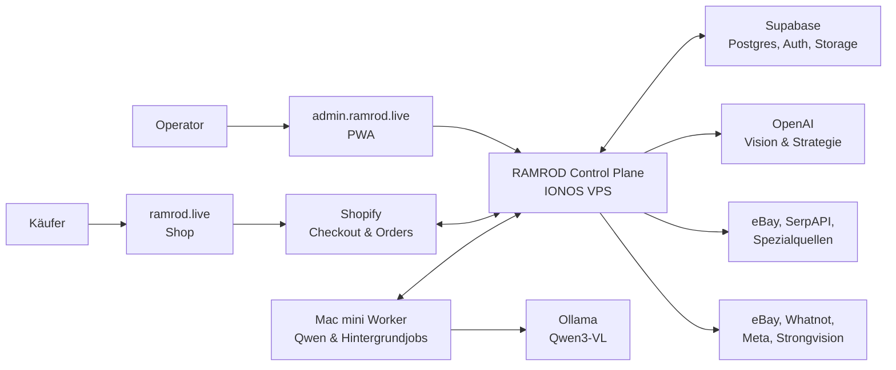

# RAMROD Masterplan

**Stand:** 19. Juli 2026
**Status:** Produkt- und Architekturgrundlage für die nächsten Builds
**Geltungsbereich:** Strongvision, CREATORS, Kommissionsware und spätere allgemeine Secondhand-Kategorien

## 1. Kurzfassung

RAMROD verwandelt unsortierte Bestände in verkaufsfähige, kanalübergreifend steuerbare Ware. Ein Operator fotografiert einen oder mehrere Gegenstände. Das System identifiziert sie, bewertet Zustand und Vollständigkeit, recherchiert Marktpreise, schlägt eine Verkaufsstrategie vor und bereitet alle benötigten Inhalte vor. Der Mensch korrigiert nur Unsicherheiten und gibt die Veröffentlichung frei.

Das Ziel ist nicht, möglichst viele Listings zu erzeugen. RAMROD soll **Deckungsbeitrag, Verkaufswahrscheinlichkeit und Umschlag pro Arbeitsstunde** maximieren.

RAMROD besteht deshalb aus drei Maschinen:

1. **Inventory Engine:** Erfassen, erkennen, bewerten und physisch auffindbar lagern.
2. **Commerce Engine:** Preis, Kanal, Listing, Verkauf, Delisting, Versand und Abrechnung steuern.
3. **Demand Engine:** Eigener Shop, Drops, Instagram, Live-Shows, Inhalte, Kampagnen und Wiederkäufer aufbauen.

## 2. Vision

> Ein Foto hinein, eine begründete Verkaufsstrategie heraus. Nach einer menschlichen Freigabe erledigt RAMROD den restlichen Verkaufsprozess so weit wie technisch und wirtschaftlich sinnvoll autonom.

Langfristig soll die Plattform nicht nur Nerd-Artikel verarbeiten. Spiele, Toys und Collectibles sind der erste vertikale Markt, weil hier Bilderkennung, Zustandsbewertung, Varianten und Preiswissen besonders wertvoll sind. Das Datenmodell bleibt bewusst generisch genug für Haushaltsgeräte, Kleidung, Spielzeug, Medien und andere Secondhand-Ware.

## 3. Geschäftsziele

- Millionen schwach gepflegter Artikel in liquide, auffindbare Bestände verwandeln.
- Die benötigte Fachkenntnis des Operators drastisch reduzieren.
- Den Zeitaufwand vom Foto bis zur Freigabe auf wenige Minuten und später auf Sekunden senken.
- Preisfehler nicht komplett versprechen, sondern erkennen, begrenzen und messbar machen.
- Jeden Artikel nur einmal als Master-Datensatz führen und daraus kanalspezifische Angebote erzeugen.
- Verkäufe kanalübergreifend erkennen und Doppelverkäufe durch Reservierung und Delisting verhindern.
- Einen eigenen Kundenstamm aufbauen, damit RAMROD nicht dauerhaft vollständig von Marktplätzen abhängt.
- Kommissionsmodelle für Strongvision, CREATORS und private Einlieferer abbilden.

## 4. Produktprinzipien

### 4.1 Eine Wahrheit, viele Ausspielungen

Supabase hält den zentralen Artikelbestand. eBay, der RAMROD Shop, Whatnot und spätere Kanäle erhalten abgeleitete Listings. Plattformdaten dürfen nie zum alleinigen Masterbestand werden.

### 4.2 Automatisierung mit Beweisführung

Jede wichtige Empfehlung braucht nachvollziehbare Signale:

- erkannte Marke, Modell, Variante und Ausgabe,
- sichtbare Zustandsmerkmale,
- vergleichbare Marktangebote oder Verkäufe,
- geschätzte Kosten für Aufbereitung, Gebühren und Versand,
- Unsicherheit und offene Prüfpunkte.

### 4.3 Menschliche Freigabe am wirtschaftlichen Risiko ausrichten

Niedrigpreisige, eindeutig erkannte Standardware kann nach festen Regeln fast automatisch laufen. Seltene, teure, beschädigte oder unsicher erkannte Artikel benötigen eine explizite Prüfung.

### 4.4 Browser-Agenten sind Adapter, kein Fundament

Offizielle APIs, Webhooks und Datenfeeds sind zu bevorzugen. Browser-Automation ist sinnvoll für kontrollierte Lücken, aber nicht als einzige Grundlage für Bestandssynchronisation, Preise oder Bestellungen.

### 4.5 Schlanke Operator-Oberfläche

Die ersten Monate erledigen ein oder zwei Personen alle Rollen. Die Oberfläche folgt deshalb einem durchgängigen Arbeitsstrom statt separaten Rollen-Dashboards:

`Erfassen -> Prüfen -> Freigeben -> Verkaufen -> Versand`

## 5. Nutzer und Marktseiten

### Interne Nutzer

- **Operator:** fotografiert, ergänzt fehlende Angaben, prüft Empfehlungen und gibt frei.
- **Administrator:** verwaltet Regeln, Kanäle, Kunden, Gebühren, Berechtigungen und Integrationen.
- **Live-Verkäufer:** öffnet eine Whatnot-Kampagne und erhält sortierte Artikel, Reihenfolge und Skripte.
- **Versand:** pickt, prüft, verpackt und schließt Sendungen ab.

Diese Aufgaben können anfangs von derselben Person übernommen werden.

### Externe Nutzer

- **Einlieferer/Kunde:** besitzt Ware und erhält Status, Erlöse und Abrechnung.
- **Käufer:** entdeckt und kauft Artikel im RAMROD Shop oder auf externen Kanälen.

## 6. Domain- und Produktaufteilung

### `ramrod.live`

Öffentlicher RAMROD Shop für Käufer. Die erste Seite ist der echte Store, keine Marketing-Landingpage.

- Suche und Kategorien
- aktuelle Drops und Themenwelten
- Neu eingetroffen
- Einzelstücke und Bundles
- Produktdetails, Warenkorb und Checkout
- Kundenkonto, Merkliste und Suchalarme
- Inhalte, Sammlerwissen und Kampagnenseiten

### `www.ramrod.live`

Permanente Weiterleitung auf `ramrod.live`.

### `admin.ramrod.live`

Geschützte Operator-Konsole als responsive Web-App/PWA.

- Smartphone-Erfassung und Kamera
- KI-Erkennung und Verkaufsstrategie
- Prüfqueue und Freigabe
- Listing- und Kampagnensteuerung
- Bestand, Pick & Pack und Versand
- Kunden, Abrechnung, Integrationen und Systemstatus

### Optional später: `api.ramrod.live`

Separater API-Endpunkt für Webhooks, Worker und Integrationen. Zum MVP kann die API unter der Admin-Anwendung bleiben, sofern Routing und Sicherheitsgrenzen sauber sind.

## 7. Ende-zu-Ende-Workflow

1. **Intake anlegen:** Kunde, Kiste, Standort und optional Kommissionsvertrag erfassen.
2. **Fotos aufnehmen:** Gesamtansicht, Vorder-/Rückseite, Etikett, Zubehör und Schäden. Orientierung wird automatisch korrigiert.
3. **Artikel erkennen:** Kategorie, Marke, Produkt, Variante, Jahr, Region, Modellnummer und sichtbare Merkmale extrahieren.
4. **Evidence Gate:** Unsichere Identitäten, unlesbare Details oder fehlende Pflichtfotos führen zu gezielten Rückfragen statt zu erfundenen Angaben.
5. **Zustand bewerten:** Funktionsprüfung, Vollständigkeit, Verpackung, Kratzer, Brüche, Geruch, Vergilbung und relevante Sammlermerkmale.
6. **Markt recherchieren:** aktive Angebote, verkaufte Vergleichsartikel und spezialisierte Preisquellen gewichten.
7. **Strategie berechnen:** unverändert verkaufen, reinigen, testen, reparieren, Teil austauschen, bündeln, aufteilen, versteigern, live verkaufen oder liquidieren.
8. **Wirtschaftlichkeit prüfen:** erwarteter Mehrerlös minus Teile, Arbeit, Risiko, Gebühren und Verzögerung.
9. **Freigabe:** Operator sieht Empfehlung, Gründe, Preisband, Kanal, offene Risiken und erwarteten Nettoerlös.
10. **Publizieren:** kanalspezifische Texte, Fotos, Merkmale, Preise und Versanddaten erzeugen.
11. **Nachfrage erzeugen:** Artikel einem Drop, einer Social-Kampagne, einem Themenfeed oder einer Live-Show zuordnen.
12. **Verkauf synchronisieren:** Bestand reservieren, andere Listings beenden, Auftrag anlegen und Käufer informieren.
13. **Versenden:** Lagerplatz, Packhinweise, Gewicht, Label und Tracking verwenden.
14. **Abrechnen und lernen:** Erlös, Gebühren, Arbeitszeit, Abweichung zur Prognose und Kundenanteil speichern.

## 8. Verkaufsstrategie pro Artikel

Die Strategie-Engine soll nicht nur einen Preis nennen, sondern eine Entscheidung zwischen Alternativen treffen.

Beispiel PS3 mit Kratzer an der Front:

| Option | Erwarteter Erlös | Aufwand/Kosten | Risiko | Entscheidung |
| --- | ---: | ---: | --- | --- |
| Wie gesehen verkaufen | 75 EUR | 0 EUR / 5 min | niedrig | Basiswert |
| Reinigen und polieren | 89 EUR | 2 EUR / 15 min | niedrig | sinnvoll |
| Front austauschen | 105 EUR | 22 EUR / 45 min | mittel | nur bei sicherem Mehrerlös |
| Mit Spielen bündeln | 125 EUR | Bestand wird gebunden | mittel | abhängig von Bundle-Nachfrage |

Die Entscheidung basiert auf dem **erwarteten Netto-Mehrwert pro zusätzlicher Arbeitsminute**, nicht nur auf dem höchsten Verkaufspreis.

## 9. Kanalstrategie

| Kanal | Hauptrolle | Geeignete Ware | Automatisierung |
| --- | --- | --- | --- |
| RAMROD Shop | Marge, Marke, Wiederkäufer | gute Einzelstücke, kuratierte Bundles, Drops | API-first |
| Google Shopping | qualifizierter Traffic zum Shop | shopfähige Artikel mit stabiler Produktseite | Merchant API / Feed |
| eBay | Reichweite und Preissignale | klar suchbare Einzelartikel | API-first |
| Whatnot | Unterhaltung und schneller Abverkauf | thematisch passende, live erklärbare Ware | Kampagnen + Verkäuferassistenz |
| TikTok Shop | Discovery Commerce und Live | visuelle Produkte, Einstiegsartikel, Drops | Partner-API nach Freigabe |
| Instagram | Nachfrage und Vertrauen | visuelle Fundstücke, Vorher/Nachher, Drops | Content-Plan + Freigabe |
| Kleinanzeigen | lokale Nachfrage und Abholung | sperrige Ware, Konsolen-Bundles, Kisten | browser-assistiert |
| Strongvision Shop | Kundenkanal | vereinbarte Bestände | späterer Connector |
| Spezialbörsen | hohe Fachzielgruppe | TCG, LEGO, Musik, Vintage, seltene Objekte | Adapter je Vertikale |
| Lokal/B2B/Liquidation | Geschwindigkeit | sperrige, geringe oder sehr große Posten | regelbasiert |

Die vollständige Kanalbewertung, Account-Regeln, Agenten-Rolle und Build-Reihenfolge stehen in [MARKETPLACE_ANALYSIS.md](MARKETPLACE_ANALYSIS.md).

## 10. Der RAMROD Shop

### 10.1 Empfohlene technische Richtung

**Empfehlung:** Shopify als transaktionales Shop-System und RAMROD/Supabase als Inventar- und Strategie-Master.

Warum:

- Checkout, Zahlungen, Steuern, Bestellungen, Kundenkonto und Rückerstattungen sind produktionsreif.
- Ein individuell gestaltetes Theme reicht für den ersten Shop und ist schneller als ein komplett eigener Commerce-Stack.
- RAMROD veröffentlicht freigegebene Artikel über die Shopify Admin API und empfängt Bestellungen über Webhooks.
- Ein späteres Headless-Frontend bleibt möglich, wenn die Marke oder Performance es rechtfertigt.

WooCommerce auf IONOS ist möglich, erzeugt aber mehr Betriebs-, Plugin-, Update- und Sicherheitsarbeit. Einen eigenen Checkout sollten wir im MVP nicht bauen.

### 10.2 Shop-Informationsarchitektur

- **Neu eingetroffen**
- **Drops**
- **Games** nach Plattform und Generation
- **Toys & Figuren** nach Franchise, Hersteller und Maßstab
- **Comics & Karten** nach Reihe und Set
- **Bundles**
- **Unter 25 EUR**
- **Selten & besonders**
- **Deals mit sichtbaren Mängeln**
- **Alle Kategorien** für spätere allgemeine Secondhand-Ware

### 10.3 Produktseite eines gebrauchten Einzelstücks

- große, unbeschnittene Originalfotos,
- exakte Identität und Variante,
- klare Zustandsnote mit beobachteten Mängeln,
- Lieferumfang und fehlende Teile,
- getestet/nicht getestet mit Prüfmethode,
- Serien-/Modellnummer, Region und Sprache, wenn relevant,
- Herkunft beziehungsweise Einlieferung ohne unnötige Personendaten,
- Versandzeit, Rückgabe und Käufervertrauen,
- passende Artikel, Bundle-Vorschlag und Suchalarm.

Interne KI-Sicherheit wird nicht als Kaufsignal missbraucht. Käufer sehen überprüfbare Fakten.

## 11. Demand Engine: Instagram, Drops und Inhalte

Instagram darf nicht zu einem automatischen Strom austauschbarer Produktkarten werden. Die Einheit ist eine **Kampagne oder Geschichte**, nicht ein einzelnes Listing.

### Inhaltssäulen

1. **Fund des Tages:** ein ungewöhnliches Stück und seine Geschichte.
2. **Was ist es wert?:** kurze Preisauflösung mit Belegen.
3. **Vorher/Nachher:** Reinigung, Test oder sinnvolle Reparatur.
4. **Kistenöffnung:** wiederkehrendes Videoformat mit Cliffhanger.
5. **Themen-Drop:** zum Beispiel PS3-Woche, TMNT, Star Wars oder Pokémon.
6. **Sammlerwissen:** Varianten, Fälschungsmerkmale, Vollständigkeit.
7. **Live-Vorschau:** Artikel und Reihenfolge der nächsten Whatnot-Show.
8. **Community-Entscheidung:** verkaufen, reparieren, bündeln oder behalten?

### Automatisierungsablauf

1. Freigegebene Artikel werden automatisch zu Themenclustern gruppiert.
2. Ein Agent erstellt Hook, Caption, Shotlist, Voice-over, Untertitel und Varianten.
3. Produktfotos und kurze Clips werden in feste RAMROD-Templates gesetzt.
4. Ein Mensch prüft in der Startphase Marke, Fakten, Musikrechte und Preisversprechen.
5. Meta Graph API beziehungsweise ein zugelassenes Publishing-Tool plant Posts.
6. Jeder Inhalt verlinkt auf eine passende Drop- oder Produktseite.
7. Klicks, Warenkörbe, Verkäufe und organische Signale fließen zurück in die Strategie.

### Keine vollautonomen Ads im MVP

Budget, Zielgruppen und Claims benötigen anfangs Freigaben. Der Agent darf Varianten vorschlagen und kleine kontrollierte Tests planen; harte Budgetgrenzen und Stop-Regeln bleiben deterministisch.

## 12. Systemarchitektur

### Verantwortlichkeiten

- **IONOS VPS:** immer erreichbare API, Webhooks, Jobsteuerung, Domain, TLS und Admin-Frontend.
- **Supabase:** zentrale Datensätze, Benutzer, Bilder, Audit und Zustände.
- **Shopify:** öffentlicher Checkout, Zahlungen, Bestellungen und Kundenfunktionen.
- **Mac mini:** optionaler Worker für lokale Erkennung, Batch-Jobs und kostenarme Hintergrundarbeit. Nie alleiniger Produktionsserver.
- **OpenAI:** schnelle und hochwertige Cloud-Erkennung sowie komplexe Strategien bei Bedarf.

## 13. KI- und Entscheidungsarchitektur

### Modellrollen

- **Qwen3-VL lokal:** Voranalyse, OCR, Bildqualität, Kategorien, Batch-Verarbeitung und kostengünstige Zweitmeinung.
- **OpenAI Vision:** schnelle Erkennung, schwierige Varianten, strukturierte Strategie und Eskalation.
- **Preisquellen:** eBay und spezialisierte Datenquellen liefern Marktbelege; ein Sprachmodell ist keine Preis-Datenbank.
- **Regelwerk:** harte Grenzen für Mindestmarge, maximale Unsicherheit, Reparaturkosten, Auto-Publishing und Werbebudget.

### Nahezu 100 Prozent als Prozessziel

Kein einzelnes Modell erreicht bei beliebigen gebrauchten Gegenständen garantiert 100 Prozent. RAMROD nähert sich dem Ziel durch:

- mehrere verpflichtende Fotos,
- Barcode/OCR/Modellnummer,
- hierarchische Erkennung,
- Vergleich mit Katalogen und Marktangeboten,
- Konsistenzprüfungen,
- zweite Modellmeinung bei Unsicherheit,
- gezielte menschliche Rückfrage statt Raten,
- Lernen aus Korrekturen und echten Verkaufsergebnissen.

## 14. Datenmodell

### Bereits vorgesehen beziehungsweise vorhanden

- `customers`
- `boxes`
- `items`
- `item_images`
- `price_checks`
- `channels`
- `campaigns`
- `campaign_items`
- `listings`
- `sales`
- `shipments`
- `audit_events`
- `jobs`
- `workers`

### Für Shop und Demand Engine ergänzen

- `shops` und `shop_connections`
- `inventory_reservations`
- `catalog_publications`
- `content_campaigns`
- `content_assets`
- `social_posts`
- `audiences`
- `marketing_events`
- `attribution_events`
- `price_rules`
- `consignment_contracts`
- `fees` und `payouts`
- `returns`

## 15. Status heute

### Bereits umgesetzt oder technisch angelegt

- responsive Erfassung mit Smartphone-Kamera,
- Bildorientierung und KI-Analysepfad,
- Artikel-, Kisten- und Kundengrundmodell,
- Supabase-Anbindung,
- Preischeck-Grundlage mit eBay und Websuche,
- Strategieansicht und menschliche Freigabe,
- Routing, Whatnot-Kampagnenmodell und Versandgrundlage,
- VPS-Deployment unter `ramrod.live`,
- optionaler Mac-mini-Worker und lokales Qwen3-VL,
- OpenAI-Eskalationspfad,
- eBay-Compliance-Endpunkt und Integrationsvorarbeit.

### Noch nicht produktionsreif

- öffentlicher Shop und Checkout,
- Domain-Trennung `ramrod.live` / `admin.ramrod.live`,
- echte Shop-Publikation und Bestell-Webhooks,
- belastbare eBay-Draft-/Publish-/Order-Synchronisation,
- Sold-Price-Daten in ausreichender Qualität,
- kanalübergreifende Reservierung und automatisches Delisting,
- vollständiger Whatnot-Workflow,
- Instagram- und Content-Pipeline,
- Kommissionsverträge, Gebühren und Auszahlungen,
- Retouren und rechtliche Shop-Texte,
- Monitoring, Backups, Rate-Limits und produktive Sicherheitshärtung,
- messbarer Lernzyklus aus Prognose versus Verkauf.

## 16. Roadmap

### Phase 1: Domain-Trennung und Shop-Fundament

- Admin-Konsole auf `admin.ramrod.live` verschieben.
- `ramrod.live` für den öffentlichen Shop freimachen.
- Shopify-Shop anlegen und RAMROD-Theme erstellen.
- Supabase-Artikel zu Shopify-Produkten publizieren.
- Bestell-Webhook, Reservierung und Statusrückfluss implementieren.

### Phase 2: Echte Freigabe-Demo

- Smartphone-Aufnahme bis zur Strategie in einem geführten Ablauf.
- Mehrfoto-Erfassung und Evidence Gate.
- Reparatur-/Bundle-Wirtschaftlichkeit.
- „Freigeben und verkaufen“ mit echter Shop-Veröffentlichung.
- komplette Demo mit einem realen PS3-Artikel durchspielen.

### Phase 3: eBay und Bestandswahrheit

- Browse- und Sold-Price-Quellen verbessern.
- eBay-Draft und Veröffentlichung produktiv schalten.
- Order-Sync, Reservierung und Cross-Channel-Delisting.
- Fehlerqueue und Wiederholungslogik.

### Phase 4: Demand Engine MVP

- automatische Themencluster und Drops,
- Instagram-Content-Briefs und Templates,
- menschliche Content-Freigabe,
- Meta-Produktkatalog und Kampagnenlinks,
- Attribution vom Post bis zum Verkauf.

### Phase 5: Whatnot und Skalierung

- Kampagnen automatisch nach kompatiblen Themen bilden,
- Show-Reihenfolge, Skripte und Preisanker,
- Verkaufserfassung und Bestandsabgleich,
- Kommissionsabrechnung und Kundenportal.

### Phase 6: Kontrollierte Autonomie

- Auto-Freigabe nur für definierte Risikoklassen,
- dynamische Preisregeln nach Lageralter und Nachfrage,
- automatisierte Content- und Anzeigenexperimente mit Budgetgrenzen,
- weitere Kategorien und spezialisierte Adapter.

## 17. Kennzahlen

- Zeit vom ersten Foto bis zur verkaufsfertigen Freigabe
- Anteil eindeutig erkannter Artikel
- Anteil ohne manuelle Datenkorrektur
- Preisabweichung zwischen Prognose und realem Verkauf
- Sell-through nach 30, 60 und 90 Tagen
- Deckungsbeitrag pro Artikel und pro Operator-Stunde
- durchschnittliches Bestandsalter
- Anteil eigener Shop am Gesamtumsatz
- Wiederkaufrate und E-Mail-/Suchalarm-Abonnenten
- Content-Klickrate, Warenkorbrate und Umsatz pro Kampagne
- Doppelverkaufs-, Storno- und Retourenquote

## 18. Sicherheit und Betrieb

- API-Schlüssel ausschließlich serverseitig in Secret Stores oder geschützten Env-Dateien.
- Keine Secrets im Browser, Git-Repository, Screenshot oder Dokument.
- Supabase RLS, getrennte Service-Rollen und Audit-Logs.
- Admin-Zugriff mit Authentifizierung, später MFA.
- Signierte Webhooks, Idempotency Keys und deduplizierte Aufträge.
- Backups, Healthchecks, Fehlerqueue und Alarmierung.
- DSGVO-konforme Aufbewahrung von Kunden-, Bild- und Kommissionsdaten.
- Rechteprüfung für Musik, Franchise-Abbildungen und Social-Media-Assets.

## 19. Offene Produktentscheidungen

1. Wer ist rechtlicher Verkäufer im RAMROD Shop?
2. Welches Provisions- und Gebührenmodell gilt je Einlieferer?
3. Shopify Basic versus höherer Plan und welche Zahlungsanbieter?
4. Welche Artikel dürfen zuerst automatisch freigegeben werden?
5. Welche Instagram-Marke und welcher bestehende Account werden genutzt?
6. Welche Foto- und Video-Station steht physisch im CREATORS?
7. Welche Rückgabe-, Prüf- und Gewährleistungsregeln gelten je Zustandsklasse?
8. Welche Sold-Price-Quelle wird für Games und Collectibles priorisiert?

## 20. Nächster verbindlicher Build

Der nächste Build ist eine vollständige vertikale Scheibe mit einem echten Gegenstand:

1. PS3 am Smartphone mit mehreren Fotos erfassen.
2. Identität, Kratzer und Vollständigkeit erkennen.
3. Marktpreis und vier Handlungsoptionen vergleichen.
4. Empfehlung und Nettoeffekt verständlich anzeigen.
5. Mit einem Klick freigeben.
6. Produkt im RAMROD Shop als echtes, aber kontrolliertes Testprodukt veröffentlichen.
7. Bestellung im Sandbox-/Testmodus zurück in RAMROD synchronisieren.
8. Artikel reservieren, Pick-&-Pack-Auftrag erzeugen und den gesamten Ablauf messen.

Erst wenn dieser Ablauf belastbar funktioniert, werden weitere Agenten oder zusätzliche Kanäle ergänzt.
